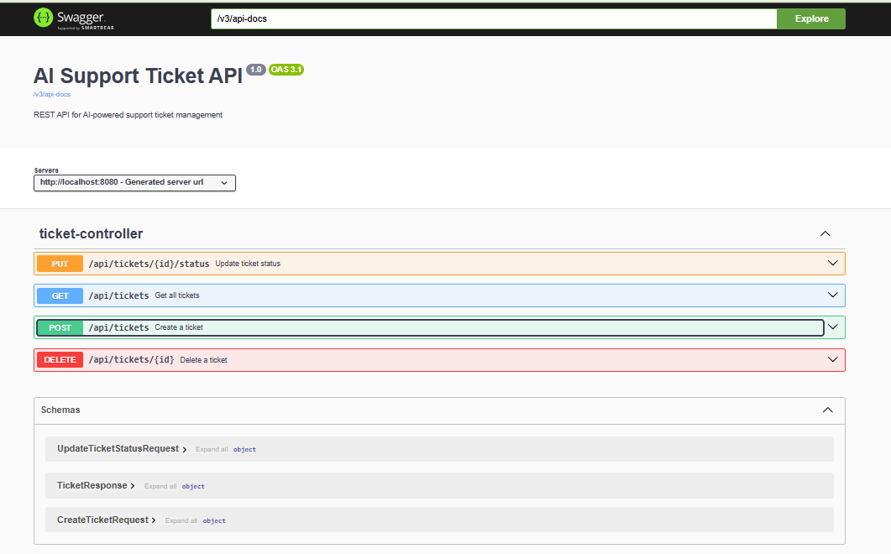
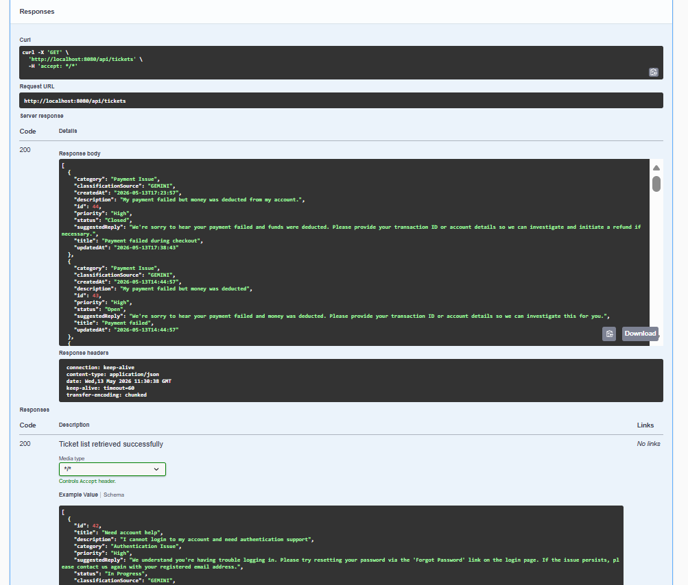
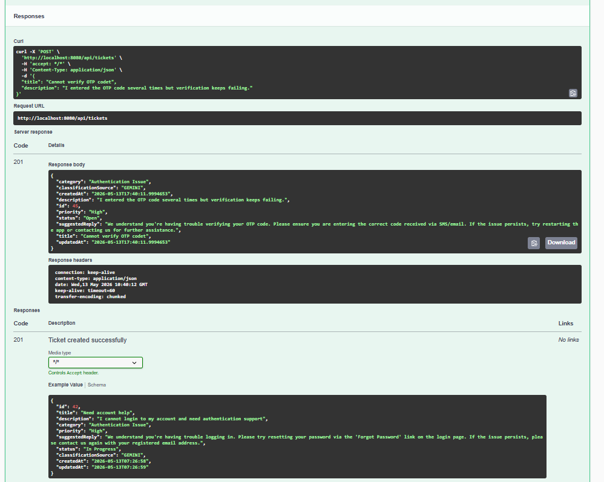
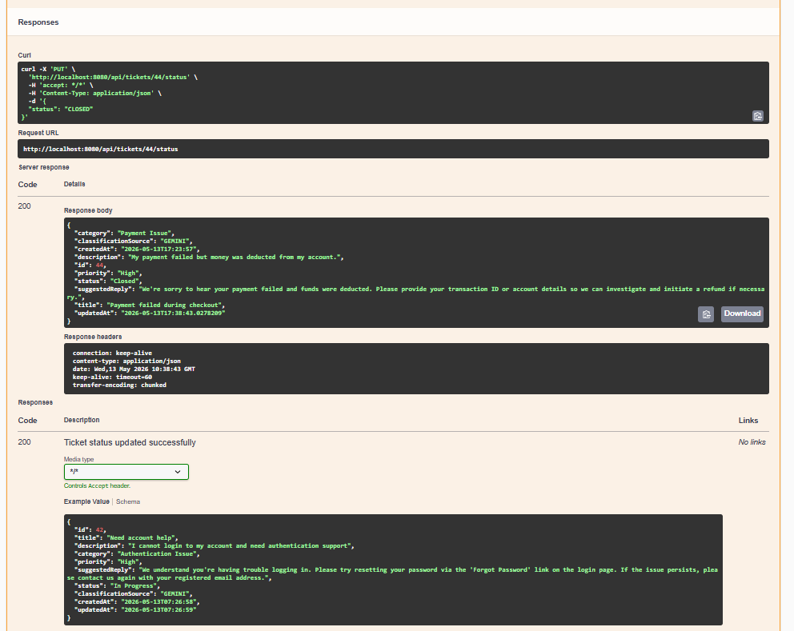
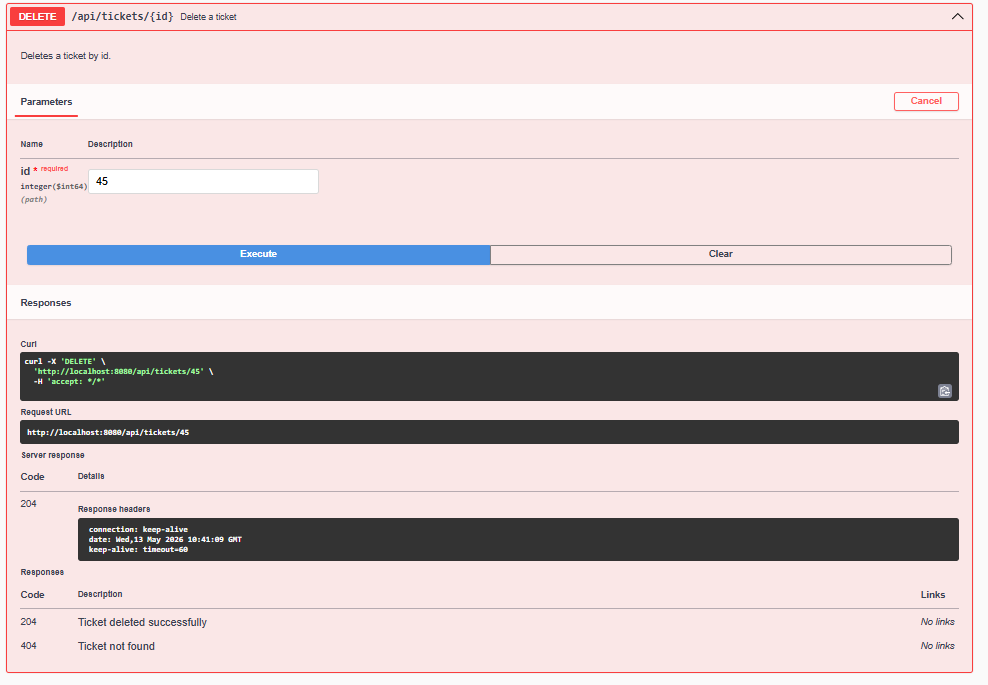

# AI-Powered Support Ticket System

A backend REST API system for managing customer support tickets.  
The system integrates Gemini API to classify ticket categories, detect priority levels, and generate automated response suggestions.

## Features

- Create support tickets
- View all tickets
- View ticket details by ID
- Update ticket status
- Delete tickets
- AI-powered ticket classification
- Priority detection
- Automated response suggestions
- Swagger API documentation

## Tech Stack

- Java
- Spring Boot
- Spring MVC
- Spring Data JPA
- MySQL
- Gemini API
- Swagger UI
- Maven

## Architecture Diagram

```text
Client / Postman / Swagger UI
        |
        v
Spring Boot REST API
        |
        v
Ticket Controller
        |
        v
Ticket Service
   |            |
   v            v
MySQL        Gemini API
```

## API Endpoints

| Method | Endpoint | Description |
|---|---|---|
| POST | `/api/tickets` | Create a new ticket |
| GET | `/api/tickets` | Get all tickets |
| GET | `/api/tickets/{id}` | Get ticket by ID |
| PUT | `/api/tickets/{id}/status` | Update ticket status |
| DELETE | `/api/tickets/{id}` | Delete ticket |

## Example Request

```json
{
  "title": "Payment failed",
  "description": "Money was deducted but transaction failed"
}
```
## Example Response
```json
{
  "id": 1,
  "title": "Payment failed",
  "description": "Money was deducted but transaction failed",
  "category": "Payment Issue",
  "priority": "High",
  "status": "Open",
  "suggestedReply": "Please check the transaction history and verify the payment gateway status."
}
```

## How to Run
1. Clone the repository
```
git clone https://github.com/ng-quys/AI-Powered-Support-Ticket-System.git
cd AI-Powered-Support-Ticket-System/AISupportTicketSystem
```

2. Create MySQL database
```
CREATE DATABASE ai_support_ticket_db;
```
3. Configure application.properties
```
spring.datasource.url=jdbc:mysql://localhost:3306/ai_support_ticket_db
spring.datasource.username=root
spring.datasource.password=your_password

gemini.api.key=your_gemini_api_key
```
4. Run the application
```bash
./mvnw spring-boot:run
```

5. Swagger UI
After running the project, open:
```
http://localhost:8080/swagger-ui/index.html
```

## Screenshots

### Swagger API Documentation


### Get Ticket Response


### Create Ticket Response


### Put Ticket Reponse


### Delete Ticket Response



## Author

**Ho Ngoc Quy**

- GitHub: https://github.com/ng-quys
- Email: hnquy08@gmail.com


